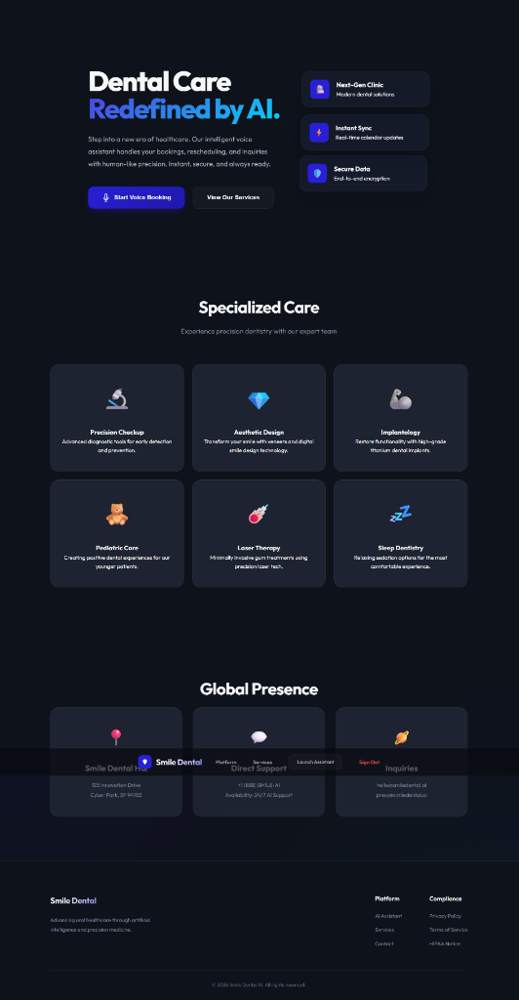
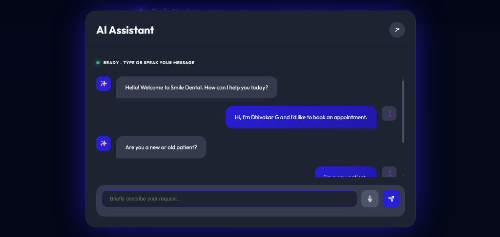
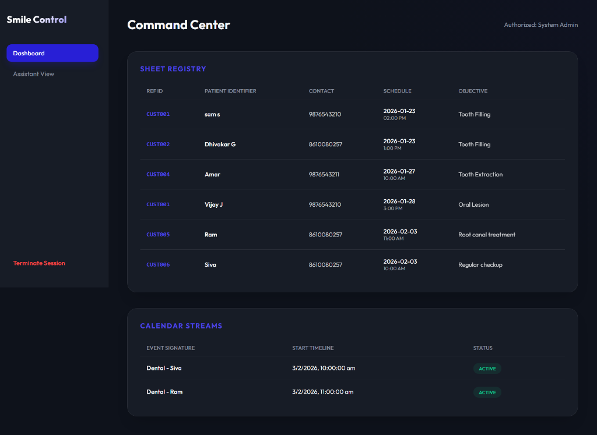

# 🦷 Smile Dental - AI-Powered Dental Assistant Platform



A premium, modern dental appointment management system that redefines patient interaction. Built with a glassmorphic design system and powered by advanced AI, Smile Dental offers a seamless booking experience through both a **futuristic web interface** and a **real-time voice assistant** via phone calls.

## ✨ Key Features

### 🤖 **Dual-Mode AI Assistant**
The core of Smile Dental is an intelligent conversational agent capable of understanding context, managing appointments, and handling complex queries.
-   **Web Assistant**: Interactive chat/voice interface directly on the website.
-   **Telephony Support**: Call the clinic's number to talk to the AI agent just like a human receptionist (powered by Twilio).

### 📅 **Smart Scheduling Engine**
-   **Instant Booking**: Collects Name, Phone, Date, Time, and Reason in natural language.
-   **Real-Time Sync**: Automatically creates Google Calendar events and updates Google Sheets.
-   **Intelligent Logic**: Enforces business hours (Mon-Sat, 9-5) and prevents scheduling conflicts.
-   **Rescheduling & Cancellation**: seamless modification of existing appointments with automatic calendar cleanup.

### � **Comprehensive Data Management**
-   **Customer Master Database**: Immutable records for every patient with unique Customer IDs.
-   **Appointment Logs**: Detailed history of every interaction and booking.
-   **Admin Dashboard**: Secure portal for staff to view analytics and manage schedules.

## 🖼️ Gallery

| AI Assistant Modal | Admin Dashboard |
|--------------------|-----------------|
|  |  |

| Customer Database | Appointment Log |
|-------------------|-----------------|
|  |  |

##⚡ Quick Start Guide

Follow these steps to set up the project from scratch.

### 1. Prerequisites
Ensure you have the following installed/configured:
-   **Python 3.8+**
-   **Ollama**: Install from [ollama.ai](https://ollama.ai) and pull the model: `ollama pull qwen2.5-coder:3b`
-   **Google Cloud Console**: Enable **Calendar API** and **Sheets API**.
-   **Twilio Account**: For phone capabilities (Optional).
-   **Ngrok**: For checking local development with Twilio.

### 2. Installation

**Clone the Repository**
```bash
git clone https://github.com/Dhivakar2005/DentalVoiceAgent.git
cd DentalVoiceAgent
```

**Install Dependencies**
```bash
pip install -r requirements.txt
```

**Configure Credentials**
1.  Place your Google `credentials.json` file in the root directory.
2.  (Optional) Ensure `sheets_config.json` is present or let the app generate it.

### 3. Running the Application

**Step 1: Start the Local LLM**
Open a terminal and run:
```bash
ollama serve
```

**Step 2: Start the Web Server**
Open a new terminal in the project folder and run:
```bash
python server.py
```
*The server will start at `http://localhost:5000`.*

### 4. How to Use

#### 🌐 Option A: Web Interface
1.  Open your browser and navigate to `http://localhost:5000`.
2.  Sign up or Log in.
3.  Click **"Launch Assistant"** or **"Start Voice Booking"**.
4.  Speak or type to the AI to book your appointment.

#### 📞 Option B: Phone Call (Twilio)
1.  Expose your local server to the internet:
    ```bash
    ngrok http 5000
    ```
2.  Copy the HTTPS URL generated by ngrok.
3.  In your **Twilio Console** (Phone Numbers > Manage > Active Numbers), set the **Voice Webhook** to:
    ```
    YOUR_NGROK_URL/twilio/voice
    ```
4.  **Call your Twilio number!** The AI will answer and handle your booking just like on the website.

## 🏗️ Project Structure
```
Dental/
├── app.py                      # Core AI Agent Logic
├── server.py                   # Flask Web Server & Twilio Webhook
├── google_sheets_manager.py    # Database Persistence Layer
├── templates/                  # Frontend HTML Pages
├── static/                     # CSS & JavaScript Assets
│   ├── css/style.css           # Premium Glassmorphism UI
│   └── js/app.js               # Frontend Logic
└── assets/                     # Project Screenshots & Documentation
```

## 🔧 Technical Stack
-   **Backend**: Flask, Python
-   **AI/LLM**: Ollama (qwen2.5-coder:3b)
-   **Telephony**: Twilio Voice API, TwiML
-   **Database**: Google Sheets API, MongoDB (Auth)
-   **Scheduling**: Google Calendar API
-   **Frontend**: Vanilla JS, Modern CSS3, HTML5

## 🔒 Security & Privacy
-   **Role-Based Access**: Separate portals for Patients and Admins.
-   **Data Privacy**: Customer IDs are permanent and unique.
-   **Secure Auth**: Bcrypt encryption for user credentials.