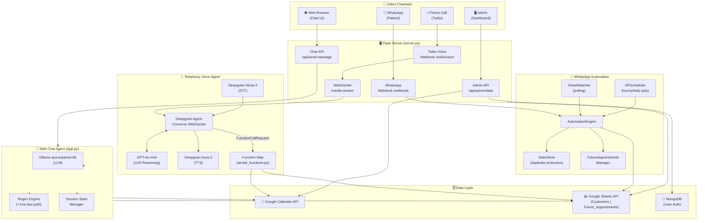

# 🦷 Smile Dental — AI-Powered Dental Clinic Automation Platform

<div align="center">


**A full-stack dental clinic AI platform combining a real-time telephony voice agent, a conversational web chatbot, and an automated WhatsApp scheduling engine — all backed by Google Calendar and Google Sheets.**

</div>

---

## 📌 Table of Contents

- [Overview](#-overview)
- [Architecture](#-system-architecture)
- [Modules](#-modules)
  - [1. Telephony Voice Agent](#1-telephony-voice-agent-twilio--deepgram)
  - [2. Web Chat Agent](#2-web-chat-agent-web-chatbot)
  - [3. WhatsApp Scheduling Automation](#3-whatsapp-scheduling-automation)
  - [4. Admin Dashboard](#4-admin-dashboard)
- [Flow Diagrams](#-flow-diagrams)
  - [Telephony Call Flow](#telephony-call-flow)
  - [Booking Workflow](#booking-workflow)
  - [WhatsApp Automation Flow](#whatsapp-automation-flow)
  - [WhatsApp Reply Handling](#whatsapp-reply-handling)
- [Tech Stack](#-tech-stack)
- [Project Structure](#-project-structure)
- [Environment Setup](#-environment-setup)
- [Installation & Launch](#-installation--launch)
- [API Reference](#-api-reference)
- [Security](#-security)

---

## 🔍 Overview

**Smile Dental** is a production-ready dental clinic automation platform with three coordinated AI-powered systems:

| System | Channel | AI/Tech | Purpose |
|---|---|---|---|
| **Voice Agent** | Phone (Twilio) | Deepgram Nova-3 STT + GPT-4o-mini + Deepgram Aura-2 TTS | Live AI receptionist for calls |
| **Web Chat Agent** | Browser | Ollama (aya-expanse:8b) + Regex hybrid engine | Instant 24/7 web booking assistant |
| **WhatsApp Automation** | WhatsApp (Twilio) | Rule-based engine + Google Sheets watcher | Appointment confirmations, reminders, multi-sitting predictions |
| **Admin Dashboard** | Web | Flask + Google APIs | Real-time clinic management dashboard |

All systems share a **unified data layer** (Google Sheets as CRM + Google Calendar for scheduling) and are tightly integrated at the server level.

---

## 🏗️ System Architecture


```mermaid
graph TB
    subgraph Clients["📱 Client Channels"]
        PHONE["📞 Phone Call\n(Twilio)"]
        WEB["🌐 Web Browser\n(Chat UI)"]
        WA["💬 WhatsApp\n(Patient)"]
        ADMIN["🖥️ Admin\n(Dashboard)"]
    end

    subgraph Server["🖥️ Flask Server (server.py)"]
        TW_HOOK["Twilio Voice\nWebhook /twilio/voice"]
        WS["WebSocket\n/media-stream"]
        CHAT_API["Chat API\n/api/send-message"]
        WA_HOOK["WhatsApp\nWebhook /webhook"]
        ADMIN_API["Admin API\n/api/admin/data"]
    end

    subgraph VoiceAgent["🤖 Telephony Voice Agent"]
        DGA["Deepgram Agent\nConverse WebSocket"]
        GPT["GPT-4o-mini\n(LLM Reasoning)"]
        DG_TTS["Deepgram Aura-2\n(TTS)"]
        DG_STT["Deepgram Nova-3\n(STT)"]
        FN["Function Map\n(dental_functions.py)"]
    end

    subgraph WebAgent["💬 Web Chat Agent (app.py)"]
        OLLAMA["Ollama aya-expanse:8b\n(LLM)"]
        REGEX["Regex Engine\n(<1ms fast path)"]
        STATE["Session State\nManager"]
    end

    subgraph WhatsApp["📲 WhatsApp Automation"]
        ENGINE["AutomationEngine"]
        WATCHER["SheetWatcher\n(polling)"]
        SCHED["APScheduler\n(hourly/daily jobs)"]
        STATES["StateStore\n(duplicate protection)"]
        FA["FutureAppointments\nManager"]
    end

    subgraph DataLayer["🗄️ Data Layer"]
        GCal["📅 Google Calendar API"]
        GSheets["📊 Google Sheets API\n(Customers | Future_Appointments)"]
        MongoDB["🍃 MongoDB\n(User Auth)"]
    end

    PHONE --> TW_HOOK --> WS --> DGA
    DGA <--> GPT
    DGA --> DG_TTS
    DG_STT --> DGA
    DGA -- FunctionCallRequest --> FN

    WEB --> CHAT_API --> WebAgent
    WebAgent --> OLLAMA & REGEX
    WebAgent --> STATE

    WA --> WA_HOOK --> ENGINE
    WATCHER --> ENGINE
    SCHED --> ENGINE
    ENGINE --> STATES & FA

    FN --> GCal & GSheets
    WebAgent --> GCal & GSheets
    ENGINE --> GSheets
    ADMIN --> ADMIN_API --> GCal & GSheets
    Server --> MongoDB
```

---

## 📦 Modules

### 1. Telephony Voice Agent (Twilio + Deepgram)

A **real-time, zero-silence AI receptionist** that answers the clinic's phone line. Architecture follows a proven three-task async pipeline:

- **Twilio** streams audio (µ-law 8kHz) via WebSocket to the Flask server.
- **Deepgram Agent API** handles STT (Nova-3), LLM reasoning (GPT-4o-mini), and TTS (Aura-2-Thalia).
- **Function calls** (book / reschedule / cancel / verify / lookup) are intercepted, executed server-side, and injected back as speech with zero latency.
- **Date context** is injected fresh on every call — the agent always knows today's date, tomorrow, and the 6-day booking window.
- **Per-call identity session**: once a patient is verified, their `customer_id` is stored in the session and reused — no re-asking for name/phone.

---

### 2. Web Chat Agent (Web Chatbot)

A **hybrid intent engine** for the web booking interface:

- **Fast path (< 1ms):** 15+ regex extractors resolve intent, name, phone, date, time, reason, and customer ID without invoking an LLM.
- **LLM fallback:** Ollama (aya-expanse:8b) handles ambiguous queries, confirmations, and multilingual inputs.
- **Streaming SSE:** Responses are streamed token-by-token for a premium chat experience.
- **Session management:** Each browser session gets a UUID-keyed `WebVoiceAgent` with full state persistence via MongoDB.

---

### 3. WhatsApp Scheduling Automation

An **event-driven automation engine** that monitors the Customers Google Sheet and sends contextual WhatsApp messages via Twilio:

| Workflow | Trigger | Message Type |
|---|---|---|
| New appointment | New row in Customers sheet | TYPE-A: Confirmation (no YES/NO) |
| Modified appointment | Row date/time changes | TYPE-A: Modification notice |
| Cancelled appointment | Row deleted | TYPE-A: Cancellation notice |
| 36h reminder | ~36h before appointment | TYPE-B: Informational reminder (no YES/NO) |
| Predicted appointment | ~36h before predicted sitting | TYPE-C: YES/NO confirmation request |
| Same-day reminder | 8 AM daily job | TYPE-B: Day-of reminder |
| YES reply | Patient confirms predicted date | Move to Customers sheet |
| NO reply | Patient declines | Mark DECLINED, notify team |
| Emergency keyword | "pain", "bleeding" etc. | Immediate alert |
| Unknown reply | Anything else | Friendly fallback |

**Duplicate protection:** Every message is guarded by a persistent `StateStore` with three flags: `confirmation_sent`, `reminder_sent`, `prediction_message_sent`.

**Time safety:** An absolute rule blocks processing of any appointment whose datetime ≤ now (IST).

**Multi-sitting prediction:** When a patient books for treatments requiring multiple sessions (e.g., root canal, braces), future sitting dates are auto-predicted via `services_parser.py` and stored silently in a `Future_Appointments` sheet.

---

### 4. Admin Dashboard

A **secure, real-time dashboard** for clinic staff:

- JWT cookie-based auth with role separation (`admin` / `user`).
- View all upcoming appointments pulled live from Google Sheets.
- View upcoming Google Calendar events (next 50).
- Manage user accounts (signup, login, logout).
- All sensitive data is filtered before serving to the frontend.

**Key files:** `server.py` (admin routes), `database_manager.py`, `templates/admin.html`


---

## 🛠️ Tech Stack

| Layer | Technology | Role |
|---|---|---|
| **Web Framework** | Flask 3.0 + Flask-Sock | HTTP server + WebSocket handler |
| **STT** | Deepgram Nova-3 | Real-time speech-to-text (< 300ms) |
| **LLM (Telephony)** | OpenAI GPT-4o-mini | Intent reasoning + function calling on phone |
| **LLM (Web Chat)** | Ollama aya-expanse:8b | Local LLM for web chat intent extraction |
| **TTS** | Deepgram Aura-2-Thalia | Natural female voice for TTS output |
| **Telephony** | Twilio Voice + Media Streams | Inbound calls + µ-law audio WebSocket |
| **WhatsApp** | Twilio WhatsApp API | Patient messaging & reminders |
| **Scheduling** | APScheduler | Hourly reminders + 8 AM daily jobs |
| **Sheets CRM** | Google Sheets API v4 | Patient records + appointment database |
| **Calendar** | Google Calendar API v3 | Event creation + conflict detection |
| **Auth DB** | MongoDB + Flask-Bcrypt | Staff login + session management |
| **JWT** | PyJWT (via DatabaseManager) | Secure route protection |
| **Frontend** | Vanilla JS + CSS3 | Animated, glassmorphic chat interface |
| **Tunneling (dev)** | Ngrok | Expose local Flask to Twilio/WhatsApp |

---

## 📁 Project Structure

```
DentalVoiceAgent/
│
├ server.py                        # 🚀 Main Flask server (HTTP + WebSocket + telephony)
├ app.py                           # 🤖 DentalVoiceAgent core (web chat + Calendar)
├ google_sheets_manager.py         # 📊 Google Sheets CRUD (patient CRM)
├ database_manager.py              # 🍃 MongoDB user auth + JWT
├ vector_db_manager.py             # 🔍 Vector DB for FAQ retrieval
├ ingest_logic.py                  # 📥 Ingestion helper for knowledge base
│
├ logic.json                       # ⚙️ Intent patterns + system prompts
├ services_details.json            # 🦷 Dental services catalog & treatment plans
├ sheets_config.json               # 🔑 Google Sheets spreadsheet ID config
├ agent_config.json                # 🤖 Agent-level configuration
├ credentials.json                 # 🔐 Google OAuth client credentials
├ token.pickle                     # 🔐 Cached Google OAuth token
│
├ requirements.txt                 # 📦 Core dependencies
├ .env                             # 🌍 Environment secrets (not committed)
│
├ voice_agent/                     # 📞 Telephony voice agent module
│   ├ dental_config.json           #    Deepgram Agent full config (STT+LLM+TTS+functions)
│   └ dental_functions.py          #    Tool handlers: verify/book/reschedule/cancel/lookup
│
├ scheduling_automation/           # 💬 WhatsApp scheduling automation module
│   ├ automation_engine.py         #    Core business logic router (10 workflows)
│   ├ sheet_watcher.py             #    Polls Google Sheets for row changes
│   ├ whatsapp_service.py          #    WhatsApp message templates (Twilio)
│   ├ future_appointments.py       #    Predicted multi-sitting manager
│   ├ services_parser.py           #    Resolves future dates from treatment reason
│   ├ state_store.py               #    Persistent duplicate-protection flags
│   ├ scheduler.py                 #    APScheduler job definitions
│   ├ webhook_server.py            #    WhatsApp reply webhook routes
│   ├ app_scheduler.py             #    Standalone scheduler runner
│   ├ appointment_state.json       #    StateStore persistent file
│   └ watcher_snapshot.json        #    SheetWatcher last-seen snapshot
│
├ templates/
│   ├ index.html                   # 🌐 Patient-facing chat interface
│   ├ admin.html                   # 🛡️ Admin dashboard
│   └ login.html                   # 🔐 Login / signup page
│
└ static/
    ├ css/style.css                # 🎨 Glassmorphic design system
    └ js/app.js                    # ⚡ Reactive frontend controllers
```

---

## 🌍 Environment Setup

Create a `.env` file in the project root with the following variables:

```env
# Flask
FLASK_SECRET_KEY=your-secure-random-key

# MongoDB (user authentication)
MONGO_URI=mongodb+srv://dhikrish42:<db_password>@cluster.gyo49rj.mongodb.net/?appName=Cluster

# Deepgram (STT + TTS + Agent)
DEEPGRAM_API_KEY=your-deepgram-api-key

# OpenAI (LLM for telephony)
OPENAI_API_KEY=your-openai-api-key

# Twilio (telephony + WhatsApp)
TWILIO_ACCOUNT_SID=your-twilio-account-sid
TWILIO_AUTH_TOKEN=your-twilio-auth-token
TWILIO_PHONE_NUMBER=+1xxxxxxxxxx
TWILIO_WHATSAPP_NUMBER=whatsapp:+14155238886

# Google (OAuth — sheets + calendar)
# Place credentials.json in the project root; token.pickle is auto-generated on first run.

# Dev only — bypass Twilio signature validation when testing locally
TWILIO_SKIP_VALIDATION=true
```

---

## 🚀 Installation & Launch

### Prerequisites

- Python 3.12+
- MongoDB (running locally or Atlas)
- Ollama with `aya-expanse:8b` model
- Google Cloud project with Calendar API + Sheets API enabled
- Twilio account with a voice number and WhatsApp sandbox

### Steps

```bash
# 1. Clone the repository
git clone https://github.com/Dhivakar2005/DentalVoiceAgent.git
cd DentalVoiceAgent

# 2. Install dependencies
pip install -r requirements.txt
pip install -r voice_agent/requirements.txt
pip install -r scheduling_automation/requirements_scheduler.txt

# 3. Start Ollama and pull the web chat model
ollama serve
ollama pull aya-expanse:8b

# 4. Place credentials.json (Google OAuth) in the project root.
#    On first run, a browser window will open to authorize Google access.
#    token.pickle will be saved automatically for subsequent runs.

# 5. Configure .env (see above)

# 6. Launch the server
python server.py

# 7. (For telephony) Expose the server via ngrok
ngrok http 5000
# Copy the https URL → set as Twilio webhook: https://<ngrok>/twilio/voice
```

The server starts on **http://localhost:5000**.

| URL | Purpose |
|---|---|
| `http://localhost:5000/` | Patient web chat interface |
| `http://localhost:5000/admin` | Admin dashboard (admin role required) |
| `http://localhost:5000/signin` | Login page |
| `http://localhost:5000/twilio/voice` | Twilio voice webhook |
| `http://localhost:5000/webhook` | WhatsApp reply webhook |

---

## 📡 API Reference

### Chat Session API

| Method | Endpoint | Description |
|---|---|---|
| `POST` | `/api/start-session` | Create a new chat session |
| `POST` | `/api/send-message` | Send a message (blocking) |
| `GET` | `/api/send-message-stream` | Send a message (SSE streaming) |
| `POST` | `/api/reset-session` | Reset conversation state |
| `POST` | `/api/end-session` | Terminate and remove session |
| `GET` | `/api/get-history` | Retrieve conversation history |

### Admin API

| Method | Endpoint | Auth | Description |
|---|---|---|---|
| `GET` | `/api/admin/data` | Admin JWT | Appointments + calendar events |

### Auth API

| Method | Endpoint | Description |
|---|---|---|
| `POST` | `/signin` | Authenticate and receive JWT cookie |
| `POST` | `/signup` | Register a new staff account |
| `GET` | `/logout` | Clear JWT cookie |

### Twilio/WhatsApp API

| Method | Endpoint | Description |
|---|---|---|
| `POST` | `/twilio/voice` | Twilio voice call webhook |
| `WebSocket` | `/media-stream` | Twilio Media Streams audio channel |
| `POST` | `/webhook` | WhatsApp incoming message handler |

---

## 🔐 Security

- **JWT Auth:** Staff routes are protected with HttpOnly JWT cookies (24h TTL). Roles enforced: `admin` vs `user`.
- **Twilio Validation:** All Twilio webhooks are validated via HMAC signature (`RequestValidator`). Set `TWILIO_SKIP_VALIDATION=true` only in local dev.
- **No patient data dump:** The admin API filters and returns only the fields required by the dashboard.
- **Session isolation:** Every phone call resets the patient identity session (`reset_patient_session()`), preventing cross-call data leakage.
- **Duplicate protection:** `StateStore` flags ensure no patient receives the same WhatsApp message twice, even across server restarts.

---

## 📄 License

This project is licensed under the [MIT License](LICENSE).

---

<div align="center">
  Built with ❤️ for <strong>Smile Dental Clinic</strong><br/>
  Powered by Deepgram · OpenAI · Google · Twilio · Flask
</div>
